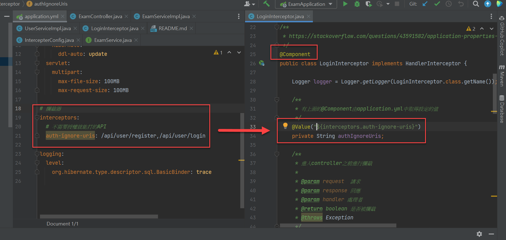
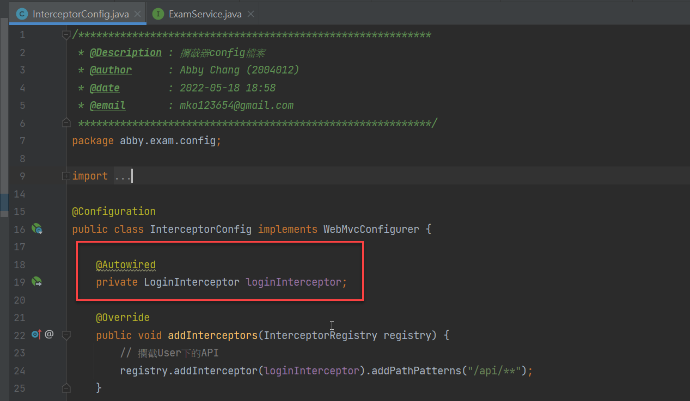

# Online Test 線上考試系统說明

## 攔截器注入application.yml中的屬性

> Interceptor在spring bean初始化之前會造成Interceptor中無法注入配置屬性，按照下面的步驟可以正常注入

+ 在LoginInterceptor.java上加入`@Component`註解

  

+ 在config中使用`@Autowired`注入

  

## 在dev開發環境下，如何設置JPA列印完整的SQL語句和參數

> 主要是指application.yml的配置

+ 印出SQL语句
  ```yaml
  spring:
    jpa:
      show-sql: true

+ 印出SQL参数
  ```yaml
  logging:
    level:
      org.hibernate.type.descriptor.sql.BasicBinder: trace
  ```